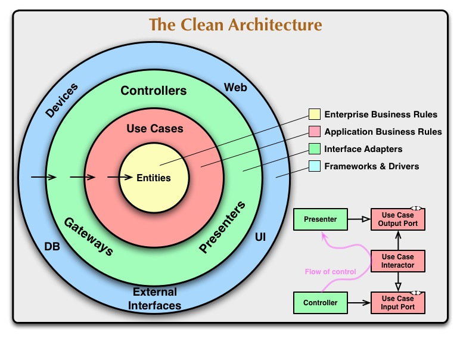

Sejam bem vindos ao nosso projeto sigrhinterno. Este projeto será desenvolvido em python seguindo os princípios de arquitetura limpa.

# Arquitetura limpa 
Arquitetura limpa no ramo de engenharia de software são vertentes de arquitetura de código que buscam facilitar o respeito aos princípios de bom desenvolvimento, incluindo os princípios SOLID. 
No geral, uma boa arquitetura deve ser responsável por separar o nosso código, nossas regras de negócio, de dependências externas. 

## Regras de negócio 
Regras de negócio são o motivo de nosso software existir. Para um banco elas envolvem a gestão de contas e serviços do banco, para o photoshop elas envolvem manipulação de imagem, para um jogo elas envolvem o design do jogo (as regras de jogo) e por aí vai. Esse é um conceito amplo que diz o motivo pelo qual você esta fazendo o software. 

## Dependências externas 
Dependência externa é basicamente todo o resto. Se não tem a ver com o nosso código em si, se não é nosso, é uma dependência externa. A web é uma dependência externa! A database é uma dependência externa! A máquina em que o código irá rodar é uma dependência externa! Acho que você entendeu a ideia.

# As camadas

Nosso código será dividido em camadas (layers). Você talvez não saiba o que é uma camada, mas há grandes chances de você já ter ouvido falar disso alguma vez porque é um padrão extremamente eficiente. 
Primeiramente, vamos desmitificar isso: camadas são conjuntos de código, só isso. No geral, nesse projeto, as camadas vão ser simplesmente diferentes pastas na estrutura do projeto. Agora nós podemos discutir algumas regras gerais para camadas: 
- As camadas tem hierarquia entre elas, sendo que há camadas mais internas e camadas mais externas. No caso de arquitetura limpa, as camadas mais internas cuidam das nossas regras de negócio, enquanto as mais externas cuidam das nossas dependências externas.
- As camadas são autorizadas a saberem de tudo que ocorre nela, então dois códigos que fazem parte da mesma camada podem se comunicar entre si. 
- Camadas externas são autorizadas a saberem de camadas internas, mas camadas internas não podem saber de camadas externas. No caso da arquitetura limpa, nós garantimos que nossas regras de negócio não serão afetas pelas dependências externas. Isso significa que você pode fazer uma camada externa que é um aplicativo mobile, ou uma camada externa que é uma página web, porém suas regras de negócio são compartilhadas entre suas aplicações.
- As camadas mais internas são mais estáveis. Isso significa que se você mudar um código numa camada interna, você terá que mudar o código nas camadas externas, pois elas dependem da camada interna. Isso faz com que mudar uma camada interna seja muito mais difícil de mudar uma camada externa e isso é excelente! As suas regras de negócio devem ser estáveis, pois elas determinam como seu negócio funciona. Mas a sua interface gráfica deve ser instável, pois você pode querer muda-la por usabilidade ou algo do tipo.

Pois bem, vamos estudar sobre as camadas na arquitetura limpa: 

## O domínio 
O domínio é a nossa camada mais interna. Ele é composto sobretudo de entidades.

### Entidades
Entidades são classes que encapsulam os dados de nossa aplicação e regras de negócio que não dependem do fato de estarmos em uma aplicação automatizada. Imagine que você está criando uma aplicação para gerenciar uma rede de transportes e logistica. Pense nas entidades Usuários e Endereços. Devido a natureza do negócio, um objeto da classe usuário não deve poder existir sem o endereço, porque nós precisamos do endereço para entregar a encomenda. Logo, isso é uma regra de negócio que pode ser encapsulada direto na entidade: a aplicação só deixa você instanciar um usuário se ele tiver um endereço. 
Algumas pessoas preferem deixar a entidade apenas como dados e colocar essas regras em outro componente na mesma camada.
Observação: Entidades são altamente relacionadas a modelos. Muitas pessoas dizem que são a mesma coisa, mas algumas vezes modelos vem como entidades que são da camada de aplicação e não de domínio. Esses detalhes não são tão importantes de saber de cór, só se lembre de seguir as convenções do seu time.

### Repositórios
Reposistórios são uma forma de interagir com as entidades, muitas vezes se relacionam com persistência. O repositório não sabe o que implementa essa persistência, ele não liga se é uma database, um arquivo, ou mesmo só uma estrutura de dados na RAM. É apenas uma interface que os casos de uso podem usar para recuperar e salvar entidades. Basicamente os repositórios são responsáveis por criar entidades.

## A aplicação
A camada de aplicação é a nossa camada intermediária. Ela envolve o que nossa aplicação faz de fato. Aqui nós temos as regras que se relacinam ao fato de estarmos fazendo um sistema automatizado. Aqui nós temos o que será exposto para a nossa interface de usuário seja como ela é.

### Casos de uso
Casos de uso são as função que determinam o que a nossa aplicação faz de fato. São os casos em que nossa aplicação pode ser usada. Basicamente são funções responsáveis por fazer o que a nossa aplicação deve fazer

## Infraestrutura
A camada de infraestrutura está relacionada com a nossas dependências externas. Essa camada é onde nós podemos falar sobre web, mobile, CLI, databases ou qualquer outra dependência. 

### Implementação de repositórios
A implementação concreta dos respositórios fica nessa camada! Aqui você pode implementar repositórios com databases ou qualquer outra coisa.

### Controllers 
Controller são classes responsáveis por apresentar os nossos casos de uso. Pode ser que nossos casos de uso sejam expostos através de uma página web, ou através de um arquivo de configuração. Qualquer coisa desse tipo é resolvida nos controllers
Os controllers também são responsáveis por injetar dependências externas nos casos de uso. Os casos de uso precisam da interface de repositórios para funcionarem, e os controllers injetam a implementação do repositório dentro do caso de uso.

### Presenters 
Presenters são responsáveis por traduzir as nossas entidades para algo apresentável. Por exemplo, talvez a sua entidade salve datas em timestamps e o presenter é responsável por traduzir o timestamp para o formato de data do usuário.
